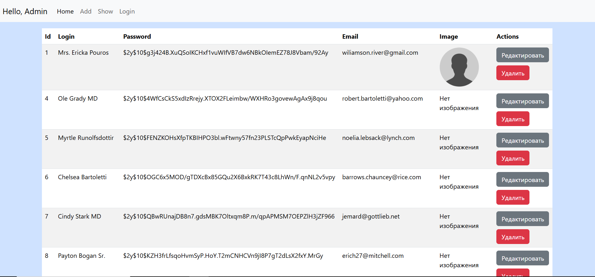

# Запуск и Установка

Установить:

- NGINX  `https://nginx.org/ru/download.html`

- php `https://windows.php.net/download`

---

 Установка web-сервера по инструкции 

 https://nginx.org/ru/docs/windows.html`

 ---

### Запуск сервера:

`php-cgi.exe -b 127.0.0.1:9123`

`start nginx`

запускаем БД SSMS

---
### Запуск приложения

http://mysite.ru/user/login

http://mysite.ru/user/add

http://mysite.ru/user/show

